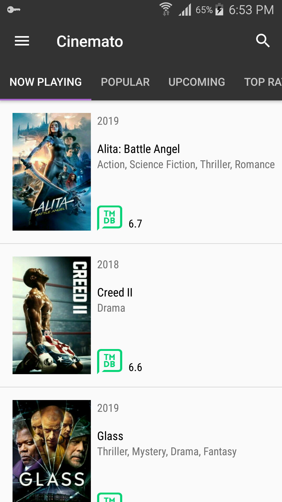

# Cinemato
Cinemato is a fully functional android app which I made from scratch.It is the fastest, easiest way to find and discover movies, actors and ratings.


### Getting Started

App uses The Movie Database API. You have to enter your API key in order to run the app. You can create your own one very easy! https://www.themoviedb.org/account/signup?language=en-EN. When you get it, just set it here:  
  ```
app/gradle.properties
```  

  
  
  
## Features

* Discover now playing, the most popular, the most rated or the upcoming movies
* Watch movie trailers and teasers
* Read reviews from other users
* Search for any movie to find detailed information, including cast, trailers, similar movies and more
* Search for any actor to see their bio, filmography, images and more
* Material Design  
  
**Download:**

You can download APK [on releases page][releases].  
  
  
## Screens  

&nbsp;&nbsp;&nbsp;&nbsp;&nbsp;&nbsp;&nbsp;&nbsp;&nbsp; 
&nbsp;&nbsp;&nbsp;&nbsp;&nbsp;&nbsp;&nbsp;&nbsp;&nbsp;
    
<br><br>
 &nbsp;&nbsp;&nbsp;&nbsp;&nbsp;&nbsp;&nbsp;&nbsp;&nbsp;
 &nbsp;&nbsp;&nbsp;&nbsp;&nbsp;&nbsp;&nbsp;&nbsp;&nbsp;
   
   
   
## Libraries

* [Retrofit](https://github.com/square/retrofit)
* [RxJava](https://github.com/ReactiveX/RxJava)
* [RxAndroid](https://github.com/ReactiveX/RxAndroid)
* [Glide](https://github.com/bumptech/glide)
* [ButterKnife](https://github.com/JakeWharton/butterknife)  
  
  
## Model-View-ViewModel Architecture (MVVM)  

The project contains an exemplification of the Model-View-ViewModel pattern used together with RxJava.  
The `DataModel` provides the data that the app needs from TMDB api.  
The `ViewModel` exposes the response as stream of events through [RxJava Observables][observables].  
The `View` is all the Activities that contain movie and actor data.


[observables]: <http://reactivex.io/documentation/observable.html>
[releases]: https://github.com/abbas-hosein-haji/Cinemato/releases
